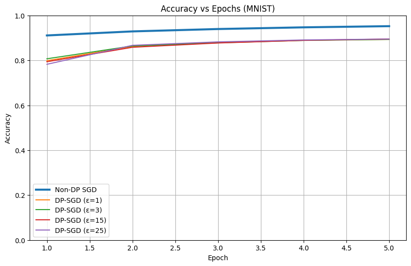
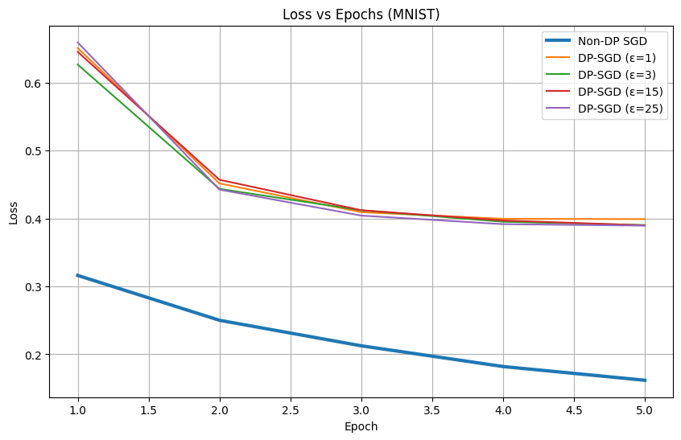
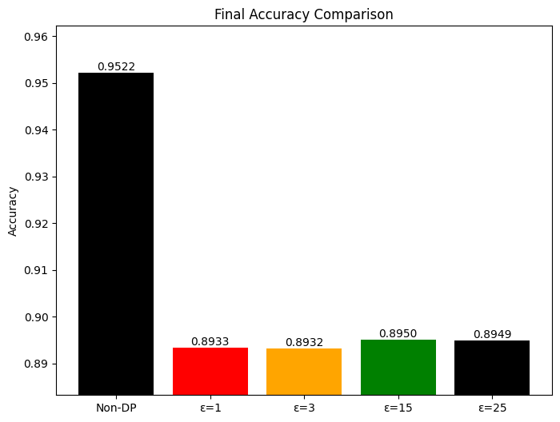
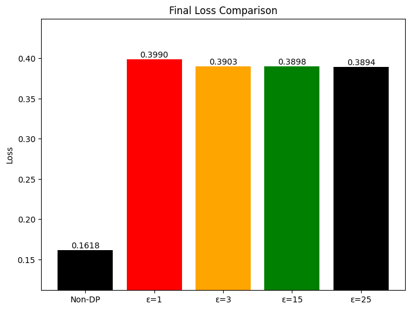
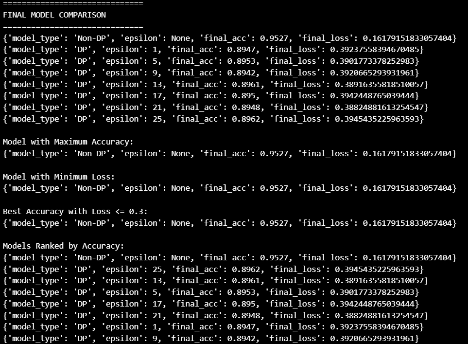

# 🔐 Differential Privacy in Deep Learning

## DP-SGD vs Standard SGD on MNIST (PyTorch + Opacus)

This repository presents a practical implementation and evaluation of **Differentially Private Stochastic Gradient Descent (DP-SGD)** compared against standard SGD using the MNIST dataset.

The project demonstrates the **privacy–utility tradeoff** by training models under varying privacy budgets (ε) and analyzing their performance.

---

# 📌 Objectives

* Implement DP-SGD using Opacus
* Compare against Non-DP SGD baseline
* Train multiple models across privacy budgets
* Automatically select:

  * Model with maximum accuracy
  * Model with minimum loss
  * Best model under loss constraint
* Visualize privacy–utility tradeoff

---

# 📊 Dataset: MNIST

* 60,000 training samples
* 10,000 test samples
* 28×28 grayscale images
* 10 digit classes

---

# 🏗 Model Architecture

Fully Connected Neural Network:

```
Flatten (784)
Linear (784 → 128)
ReLU
Linear (128 → 10)
```

Optimizer: SGD (lr = 0.1)

---

# 📂 Repository Structure

```
DP-SGD/
│
├── DP-SGD.py
├── DP-SGD.ipynb
│
├── DP_Hardcoded_Epsilon.py
├── DP_Hardcoded_Epsilon.ipynb
│
├── Screenshots/
│   ├── Accuracy_Line_Graph.png
│   ├── Loss_Line_Graph.png
│   ├── Accuracy_Bar_Graph.png
│   ├── Loss_Bar_Graph.png
│   └── Final_Model_Comparision.png
│
├── requirements.txt
├── LICENSE
└── README.md
```

---

# ⚙ Installation

```bash
pip install -r requirements.txt
```

Run dynamic epsilon version:

```bash
python DP-SGD.py
```

Run hardcoded epsilon version:

```bash
python DP_Hardcoded_Epsilon.py
```

---

# 📈 Experimental Results

## Accuracy vs Epochs



Shows convergence behavior across different ε values.

---

## Loss vs Epochs



Illustrates noise impact in DP-SGD training.

---

## Final Accuracy Comparison



Zoomed axis scaling highlights relative performance differences across privacy budgets.

---

## Final Loss Comparison



Demonstrates degradation in utility as privacy strength increases.

---

## Final Model Comparison & Ranking



The system automatically:

* Identifies model with maximum accuracy
* Identifies model with minimum loss
* Ranks models by accuracy
* Supports loss-threshold constrained selection

---

# 🔬 Implementations Included

### Dynamic Epsilon Version (DP-SGD.py)

* Dynamically generates epsilon values
* Fully automated model comparison engine
* Suitable for experimentation and scaling

### Hardcoded Epsilon Version (DP_Hardcoded_Epsilon.py)

* Fixed epsilon comparison
* Includes visualization pipeline
* Annotated bar charts and scaled axes

---

# 📌 Key Observations

* Non-DP SGD achieves highest accuracy.
* Lower ε values introduce stronger privacy but higher noise.
* Moderate ε values provide reasonable tradeoff.
* Demonstrates practical privacy–utility relationship in deep learning.

---

# 🛡 Security Relevance

DP-SGD mitigates risks such as:

* Membership inference attacks
* Model inversion attacks
* Training data reconstruction

Making it suitable for privacy-sensitive domains like healthcare and finance.

---

# 📜 License

This project is licensed under the MIT License.

---

# 👤 Author

Aditya Bhatt <br/>
Cybersecurity | Cryptography | Privacy Engineering

---
